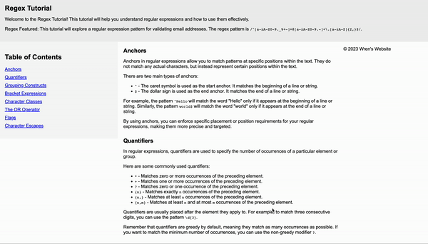

# Regex Tutorial From Wren

Welcome to the Regex Tutorial From Wren! This comprehensive guide is designed to help you understand and effectively use regular expressions. Whether you're a beginner looking to demystify regex or an experienced developer seeking a refresher, this tutorial has you covered.

## Table of Contents

- [Introduction](#introduction)
- [Summary](#summary)
- [Table of Contents](#table-of-contents)
- [Regex Components](#regex-components)
- [Author](#author)

## Introduction

Regular expressions, often abbreviated as regex or regexp, are powerful tools for pattern matching and text manipulation. However, they can be daunting for newcomers. The Regex Tutorial From Wren is here to simplify regex concepts and make them accessible.

## Summary

This tutorial focuses on a specific regex pattern: validating email addresses. We chose this pattern because it's commonly used, and understanding it will give you a strong foundation for working with regular expressions. In this tutorial, we'll cover each component of the email validation regex pattern in detail, explaining its purpose and functionality. Along the way, we'll introduce important concepts such as anchors, quantifiers, grouping constructs, bracket expressions, character classes, the OR operator, flags, and character escapes.

## Table of Contents

The table of contents provides easy navigation through the tutorial. Each section corresponds to a specific component of the email validation regex pattern, allowing you to jump directly to the information you need.

## Regex Components

In this tutorial, you'll find detailed explanations for the following regex components:

1. **Anchors**: Learn how to use `^` and `$` to match the start and end of a line or string.
2. **Quantifiers**: Explore `*`, `+`, `?`, and `{}` to control the repetition of characters.
3. **Grouping Constructs**: Understand the power of `()`, including capturing groups and non-capturing groups.
4. **Bracket Expressions**: Discover how `[ ]` can match a character from a specific set.
5. **Character Classes**: Use `\w`, `\d`, `\s`, and more to match predefined character sets.
6. **The OR Operator**: Learn how to use `|` for alternation, allowing multiple options.
7. **Flags**: Explore flags like `i`, `g`, and `m` to modify regex behavior.
8. **Character Escapes**: Find out how to escape special characters like `.`, `?`, and `*`.

Each section breaks down the functionality of the component and provides examples to illustrate its usage.

## Author

This Regex Tutorial was created by Wren, an experienced developer and regex enthusiast. Wren's goal is to make regex concepts accessible to beginners and provide valuable insights to experienced developers. Feel free to reach out with any questions or suggestions through [Wren's GitHub profile](https://github.com/nhunguyen-debug).

[View the Deployed Tutorial](https://nhunguyen-debug.github.io/Regex-Tutorial-From-Wren/)

Thank you for choosing the Regex Tutorial From Wren. Let's dive in and master regular expressions together!
